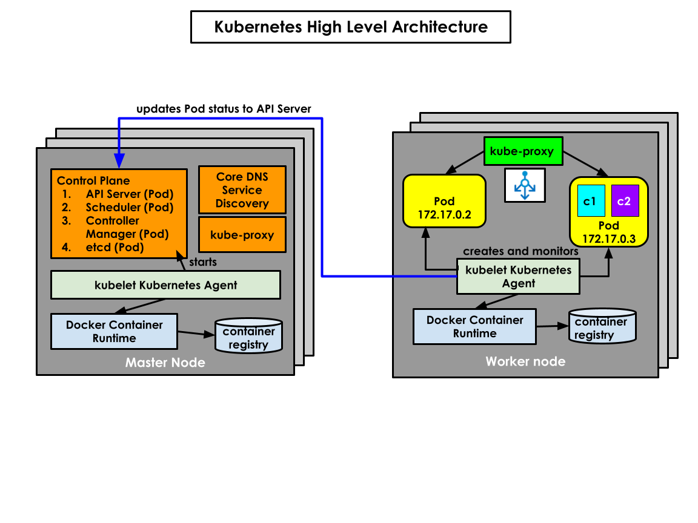

# Day 1

## What is dual/multi booting?
- boot loader utility
  - is a tiny 512 kilo bytes system utility that get installed in Master Boot Record(MBR) in the hard disk
  - when the laptop/desktop is booted, after BIOS Power On Self Test(POST) completes, the BIOS instructs CPU to run the boot loader
  - the boot loader then scans the hard disk looking for OS, it then gives a menu, listing the Operating Systems for us to choose
- in this fashion, only one OS can be active at any point of time, though you may have installed two or more OS in the same

## Virtualization Technology
- aka Hypervisor
- consolidates many physical servers into into a single server
- software + hardware technology
- Processors that supports Virtualization has a CPU feature set for Virtualization
  AMD 
   - Virtualization Feature is called AMD-V
  Intel
   - Virtualization Feature is called VT-X
- Two types
  - Type 1 (Bare Metal Hypervisors) and 
    - They can be installed directly on the hardware without installing OS
    - Used in Servers & Workstations
    - examples
      - VMWare vSphere(v-center)
  - Type 2
    - They are used in Desktops/Laptops/Workstations
    - Examples
      - VMWare
        - Fusion (Mac OS-X)
        - Workstation ( Linux/Windows)
      - Oracle VirtualBox
      - Parallels (Mac OS-X)

## What is Virtual Machine?
- is a technology that allows running multiples OS on the same desktop/laptop/workstation/server
- many OS can be active at the same time unlike the boot loader which allows only one OS active
- each Virtual Machine needs to be allocated with dedicated hardware resources, hence it is called as a heavy-weight virtualization technology

## What are the factors that controls/decides the maximum Virtual Machines a server can support?
- Total CPU Cores supported in the Processor(s)
- RAM
- Disk Size

## Linux Kernel Features that enables Container Technology
1. Namespace 
   - helps us isolate one application process from other application running on the same OS
2. Control Groups(CGroups)
   - helps us apply resource quota restrictions like
     - how many CPU cores an application can use
     - how much RAM an application can use
     - how much Disk space an application can use

## What is namespace?
- Container technology using this namespace isolates one container from another container

## What is a Container?
- normal application process that runs in a separate namespace
- is a sandbox environment which isolates your application using a namespace
- self-contained services with all dependencies bundled within a container
- one container represents one application (legacy application, it could be a REST/SOAP/WebService, Microservice, Server application like DB Server, Web Server or App Server,etc )
- the application that is containerized will also have all the dependencies of the application
- is lightweight application virtualization technology
  - containers don't require dedicated hardwares unlike Virtual machines
  - containers are application process while Virtual Machine is a fully functional Operating System

## Container Tools
- LXC
- Containerd
- Docker
- Podman

## What is Container Runtime?
- Container Runtimes are the softwares that manages containers
  - can create a container 
  - run the container
  - stop the container
  - restart the container
  - delete the container
  - abort/kill the container
- Example
  - runC
  - CRI-O

## What is a Container Engine?
- high-level software that uses Container Runtime under the hood to manage containers
- similarly they depend on other tools to manage container images
- it's user-friendly tool that provides easy to use command
- without knowing low-level details we can manage images and container with this tool
- Examples
  - Docker & Podman

## What is a Container Orchestration Tool? 
- manages containerized application (REST/SOAP API, microservices, server application, legacy self-container appliction)
- benefits of this tool
  - helps in making your applications Highly Available(HA)
  - supports in-built application monitoring features (health-check, live check)
  - in case your application stops responding or it crashes, it automatically starts another instance of your application
  - helps in scaling up/down your application on demand depending user traffic or some application performance metrics
  - supports rolling update
     - helps in upgrading/downgrading your application version from one to other version without any downtime
  - also helps you create internal only service or external service to expose your application over Internet
  - helps in using external storage for your applications
- Examples
  - Docker SWARM
  - Google Kubernetes
    - supports Custom Resource Definitions aka CRDs to add new additional features
    -  supports Operators to manage your Custom Resource (new features)
    -  open source
    -  primarily console based (CLI)
    -  supports many different types of Container Runtimes that implement CRI(Container Runtime Interface)
  - Red Hat OpenShift ( developed on top of Kubernetes )
    - backed by Red Hat ( an IBM company )
    - world-wide support can be expected unlike Kubernetes
    - supports both CLI and Web console
    - supports CRI-O container runtime and Podman Container Engine only
 
## Installing Code Ready Containers (CRC) on your Windows/Linux/Mac Laptop
```
https://developers.redhat.com/blog/2020/09/09/install-red-hat-openshift-operators-on-your-laptop-using-red-hat-codeready-containers-and-red-hat-marketplace#step_1__install_codeready_containers
```

## Control Plane Components
- they run only on the master nodes or nodes that has master role
- Control Plane Components
  - API Server
  - etcd database
  - Scheduler
  - Controller Managers

### API Server
- this implements all the Kubernetes/OpenShift functionalities as REST API
- this stores all the cluster and application status on to the etcd datastore
- this is the only component that has direct access to etcd database
- API server triggers specific events each time there is an update in the etcd database

### etcd database
- it is an opensource key/value datastore
- it is not implemented by Kubernetes/OpenShift team, this is an independent opensource project used by Kubernetes/OpenShift
- it is capable of working as a cluster, hence when one instance of etcd db is updated, all the other etcd databases within the cluster will be synchronized automatically

### Scheduler
- this is the component that identifies a healthy node where an application can be deployed

### Controller Managers
- this is a collection of many Controllers whose primary function is to monitor and heal them when required
- this is one which make your application deployments High Available(HA)
- There are many inbuilt controllers
  - Deployment Controller
  - ReplicaSet Controller
  - Node Controller
  - Endpoint Controller

## What are the Kubernetes Resources
- Deployment
- ReplicaSet
- Pod
- DaemonSet
- Job
- StatefulSet
- Namespace
- PersistentVolume
- PersistentVolumeClaim
- Service
- Ingress
- EndPoint

## What are the OpenShift Resources
- Route (Custom Resource added by OpenShift )
- DeploymentConfig  (Custom Resource added by OpenShift )
- BuildConfig (Custom Resource added by OpenShift )

## What is a Deployment?
- This represents your application deployed within Kubernetes/OpenShift
- this has a name and number of application instances and their status
- Under a deployment, you also have something called ReplicaSet
- This resource is managed by Deployment Controller
- Supports rolling update and facilitates scale up/down via ReplicaSet

## What is a ReplicaSet?
- this manages the application Pods
- this supports scaling up/down based on user traffic to your applications
- This resource is managed by ReplicaSet Controller

## What is a Pod?
- English literal meaning - group of Whales, Whale is the Docker logo
- a group of related containers is called a Pod
- as per recommended best practice, one container per Pod is good
- technically multiples containers can be part of a single Pod
- Pods are created by kubelet agent that runs in every node based on events received from API Server
- Scheduler decides where each Pod can be deployed
- ReplicaSet Controller ensures the desired number of Pods are alive, when it finds less/more than desired Pod it takes action to ensure the desired number of Pods and actual number of Pods instances matches always

## Kubernetes Architecture


## OpenShift Architecture


## OpenShift Commands

### List the OpenShift cluster nodes
Each node could be a Virtual Machine, an EC2 instance on the Cloud or a Physical Server.  Starting from OpenShift 4.x, Master nodes only supports RedHat Enterprise Core OS while Worker nodes can choose between RedHat Enterprise Core OS or Red Hat Enterprise Linux(RHEL) as their Operating System.

Red Hat Enterprise Core OS is a small foot-print Operating System that is optimized for Containerized applications and Container Orchestration Platforms.

The interesting benefit of choosing Red Hat Enterprise Core OS is, each version of Core OS comes with a specific version of CRI-O Container Runtime, also upgrading CoreOS and CRI-O version is a matter of issuing a command while RHEL OS doesn't give such an option within OpenShift.

```
oc get nodes
```

Expected output
<pre>
(root@tektutor.org)# oc get nodes
NAME                        STATUS   ROLES                         AGE   VERSION
master-1.ocp.tektutor.org   Ready    control-plane,master,worker   91m   v1.25.4+a34b9e9
master-2.ocp.tektutor.org   Ready    control-plane,master,worker   91m   v1.25.4+a34b9e9
master-3.ocp.tektutor.org   Ready    control-plane,master,worker   91m   v1.25.4+a34b9e9
worker-1.ocp.tektutor.org   Ready    worker                        51m   v1.25.4+a34b9e9
worker-2.ocp.tektutor.org   Ready    worker                        50m   v1.25.4+a34b9e9
</pre>


### List the nodes in wide mode which shows more details like IP address, etc.,
```
oc get nodes -o wide
```

Expected output
<pre>
(root@tektutor.org)# oc get nodes -o wide
NAME                        STATUS   ROLES                         AGE   VERSION           INTERNAL-IP       EXTERNAL-IP   OS-IMAGE                                                        KERNEL-VERSION                 CONTAINER-RUNTIME
master-1.ocp.tektutor.org   Ready    control-plane,master,worker   92m   v1.25.4+a34b9e9   192.168.122.46    <none>        Red Hat Enterprise Linux CoreOS 412.86.202301191053-0 (Ootpa)   4.18.0-372.40.1.el8_6.x86_64   cri-o://1.25.2-4.rhaos4.12.git66af2f6.el8
master-2.ocp.tektutor.org   Ready    control-plane,master,worker   92m   v1.25.4+a34b9e9   192.168.122.145   <none>        Red Hat Enterprise Linux CoreOS 412.86.202301191053-0 (Ootpa)   4.18.0-372.40.1.el8_6.x86_64   cri-o://1.25.2-4.rhaos4.12.git66af2f6.el8
master-3.ocp.tektutor.org   Ready    control-plane,master,worker   91m   v1.25.4+a34b9e9   192.168.122.196   <none>        Red Hat Enterprise Linux CoreOS 412.86.202301191053-0 (Ootpa)   4.18.0-372.40.1.el8_6.x86_64   cri-o://1.25.2-4.rhaos4.12.git66af2f6.el8
worker-1.ocp.tektutor.org   Ready    worker                        51m   v1.25.4+a34b9e9   192.168.122.77    <none>        Red Hat Enterprise Linux CoreOS 412.86.202301191053-0 (Ootpa)   4.18.0-372.40.1.el8_6.x86_64   cri-o://1.25.2-4.rhaos4.12.git66af2f6.el8
worker-2.ocp.tektutor.org   Ready    worker                        51m   v1.25.4+a34b9e9   192.168.122.205   <none>        Red Hat Enterprise Linux CoreOS 412.86.202301191053-0 (Ootpa)   4.18.0-372.40.1.el8_6.x86_64   cri-o://1.25.2-4.rhaos4.12.git66af2f6.el8
</pre>

### Finding more details about a node
```
oc describe node master-1.ocp.tektutor.org
```

Expected output
<pre>
(root@tektutor.org)# oc describe node master-1.ocp.tektutor.org
Name:               master-1.ocp.tektutor.org
Roles:              control-plane,master,worker
Labels:             beta.kubernetes.io/arch=amd64
                    beta.kubernetes.io/os=linux
                    kubernetes.io/arch=amd64
                    kubernetes.io/hostname=master-1.ocp.tektutor.org
                    kubernetes.io/os=linux
                    node-role.kubernetes.io/control-plane=
                    node-role.kubernetes.io/master=
                    node-role.kubernetes.io/worker=
                    node.openshift.io/os_id=rhcos
Annotations:        machineconfiguration.openshift.io/controlPlaneTopology: HighlyAvailable
                    machineconfiguration.openshift.io/currentConfig: rendered-master-023bfad24947a1c582da28124144c0aa
                    machineconfiguration.openshift.io/desiredConfig: rendered-master-023bfad24947a1c582da28124144c0aa
                    machineconfiguration.openshift.io/desiredDrain: uncordon-rendered-master-023bfad24947a1c582da28124144c0aa
                    machineconfiguration.openshift.io/lastAppliedDrain: uncordon-rendered-master-023bfad24947a1c582da28124144c0aa
                    machineconfiguration.openshift.io/reason: 
                    machineconfiguration.openshift.io/state: Done
                    volumes.kubernetes.io/controller-managed-attach-detach: true
CreationTimestamp:  Tue, 31 Jan 2023 08:10:33 +0530
Taints:             <none>
Unschedulable:      false
Lease:
  HolderIdentity:  master-1.ocp.tektutor.org
  AcquireTime:     <unset>
  RenewTime:       Tue, 31 Jan 2023 09:49:31 +0530
Conditions:
  Type             Status  LastHeartbeatTime                 LastTransitionTime                Reason                       Message
  ----             ------  -----------------                 ------------------                ------                       -------
  MemoryPressure   False   Tue, 31 Jan 2023 09:48:29 +0530   Tue, 31 Jan 2023 08:10:33 +0530   KubeletHasSufficientMemory   kubelet has sufficient memory available
  DiskPressure     False   Tue, 31 Jan 2023 09:48:29 +0530   Tue, 31 Jan 2023 08:10:33 +0530   KubeletHasNoDiskPressure     kubelet has no disk pressure
  PIDPressure      False   Tue, 31 Jan 2023 09:48:29 +0530   Tue, 31 Jan 2023 08:10:33 +0530   KubeletHasSufficientPID      kubelet has sufficient PID available
  Ready            True    Tue, 31 Jan 2023 09:48:29 +0530   Tue, 31 Jan 2023 08:14:26 +0530   KubeletReady                 kubelet is posting ready status
Addresses:
  InternalIP:  192.168.122.46
  Hostname:    master-1.ocp.tektutor.org
Capacity:
  cpu:                8
  ephemeral-storage:  104322028Ki
  hugepages-1Gi:      0
  hugepages-2Mi:      0
  memory:             64399804Ki
  pods:               250
Allocatable:
  cpu:                7500m
  ephemeral-storage:  95069439022
  hugepages-1Gi:      0
  hugepages-2Mi:      0
  memory:             63248828Ki
  pods:               250
System Info:
  Machine ID:                             f67a342e352541cc8dee96a1a711c536
  System UUID:                            f67a342e-3525-41cc-8dee-96a1a711c536
  Boot ID:                                17f59851-5b3f-483b-b70f-306193fe0493
  Kernel Version:                         4.18.0-372.40.1.el8_6.x86_64
  OS Image:                               Red Hat Enterprise Linux CoreOS 412.86.202301191053-0 (Ootpa)
  Operating System:                       linux
  Architecture:                           amd64
  Container Runtime Version:              cri-o://1.25.2-4.rhaos4.12.git66af2f6.el8
  Kubelet Version:                        v1.25.4+a34b9e9
  Kube-Proxy Version:                     v1.25.4+a34b9e9
Non-terminated Pods:                      (37 in total)
  Namespace                               Name                                                        CPU Requests  CPU Limits  Memory Requests  Memory Limits  Age
  ---------                               ----                                                        ------------  ----------  ---------------  -------------  ---
  openshift-apiserver                     apiserver-589d6c8477-b7qbj                                  110m (1%)     0 (0%)      250Mi (0%)       0 (0%)         76m
  openshift-authentication                oauth-openshift-55b9bcb7c5-7zqrw                            10m (0%)      0 (0%)      50Mi (0%)        0 (0%)         78m
  openshift-cluster-node-tuning-operator  tuned-gdjn5                                                 10m (0%)      0 (0%)      50Mi (0%)        0 (0%)         91m
  openshift-cluster-storage-operator      csi-snapshot-controller-6587df558d-tlxdd                    10m (0%)      0 (0%)      50Mi (0%)        0 (0%)         94m
  openshift-cluster-storage-operator      csi-snapshot-webhook-8688766d4c-ghkh4                       10m (0%)      0 (0%)      20Mi (0%)        0 (0%)         94m
  openshift-console                       console-7c8df7b96d-sbxvz                                    10m (0%)      0 (0%)      100Mi (0%)       0 (0%)         74m
  openshift-controller-manager            controller-manager-5444885554-kcxl6                         100m (1%)     0 (0%)      100Mi (0%)       0 (0%)         75m
  openshift-dns                           dns-default-c96vm                                           60m (0%)      0 (0%)      110Mi (0%)       0 (0%)         92m
  openshift-dns                           node-resolver-skc98                                         5m (0%)       0 (0%)      21Mi (0%)        0 (0%)         92m
  openshift-etcd                          etcd-guard-master-1.ocp.tektutor.org                        10m (0%)      0 (0%)      5Mi (0%)         0 (0%)         92m
  openshift-etcd                          etcd-master-1.ocp.tektutor.org                              360m (4%)     0 (0%)      910Mi (1%)       0 (0%)         69m
  openshift-image-registry                node-ca-rl4fc                                               10m (0%)      0 (0%)      10Mi (0%)        0 (0%)         77m
  openshift-ingress-canary                ingress-canary-fptwg                                        10m (0%)      0 (0%)      20Mi (0%)        0 (0%)         83m
  openshift-ingress                       router-default-654bbc5f99-ldqg7                             100m (1%)     0 (0%)      256Mi (0%)       0 (0%)         78m
  openshift-kube-apiserver                kube-apiserver-guard-master-1.ocp.tektutor.org              10m (0%)      0 (0%)      5Mi (0%)         0 (0%)         81m
  openshift-kube-apiserver                kube-apiserver-master-1.ocp.tektutor.org                    290m (3%)     0 (0%)      1224Mi (1%)      0 (0%)         71m
  openshift-kube-controller-manager       kube-controller-manager-guard-master-1.ocp.tektutor.org     10m (0%)      0 (0%)      5Mi (0%)         0 (0%)         91m
  openshift-kube-controller-manager       kube-controller-manager-master-1.ocp.tektutor.org           80m (1%)      0 (0%)      500Mi (0%)       0 (0%)         70m
  openshift-kube-scheduler                openshift-kube-scheduler-guard-master-1.ocp.tektutor.org    10m (0%)      0 (0%)      5Mi (0%)         0 (0%)         92m
  openshift-kube-scheduler                openshift-kube-scheduler-master-1.ocp.tektutor.org          25m (0%)      0 (0%)      150Mi (0%)       0 (0%)         75m
  openshift-machine-config-operator       machine-config-daemon-nzn45                                 40m (0%)      0 (0%)      100Mi (0%)       0 (0%)         95m
  openshift-machine-config-operator       machine-config-server-frkk7                                 20m (0%)      0 (0%)      50Mi (0%)        0 (0%)         92m
  openshift-monitoring                    alertmanager-main-1                                         9m (0%)       0 (0%)      120Mi (0%)       0 (0%)         75m
  openshift-monitoring                    node-exporter-rbqth                                         9m (0%)       0 (0%)      47Mi (0%)        0 (0%)         91m
  openshift-monitoring                    prometheus-adapter-74df4d49f8-m4ww6                         1m (0%)       0 (0%)      40Mi (0%)        0 (0%)         81m
  openshift-monitoring                    prometheus-k8s-1                                            75m (1%)      0 (0%)      1104Mi (1%)      0 (0%)         75m
  openshift-monitoring                    thanos-querier-c6fb58486-ht6cb                              15m (0%)      0 (0%)      92Mi (0%)        0 (0%)         75m
  openshift-multus                        multus-additional-cni-plugins-rjgj6                         10m (0%)      0 (0%)      10Mi (0%)        0 (0%)         96m
  openshift-multus                        multus-admission-controller-586dbf8dfd-7nf25                20m (0%)      0 (0%)      70Mi (0%)        0 (0%)         83m
  openshift-multus                        multus-qd2cp                                                10m (0%)      0 (0%)      65Mi (0%)        0 (0%)         96m
  openshift-multus                        network-metrics-daemon-4rw7d                                20m (0%)      0 (0%)      120Mi (0%)       0 (0%)         96m
  openshift-network-diagnostics           network-check-target-7zlxs                                  10m (0%)      0 (0%)      15Mi (0%)        0 (0%)         96m
  openshift-oauth-apiserver               apiserver-777bc4968c-5mxwb                                  150m (2%)     0 (0%)      200Mi (0%)       0 (0%)         76m
  openshift-route-controller-manager      route-controller-manager-58fb9bd544-62b86                   100m (1%)     0 (0%)      100Mi (0%)       0 (0%)         75m
  openshift-sdn                           sdn-controller-bv4m8                                        20m (0%)      0 (0%)      70Mi (0%)        0 (0%)         96m
  openshift-sdn                           sdn-rrcdc                                                   110m (1%)     0 (0%)      220Mi (0%)       0 (0%)         96m
  openshift-service-ca                    service-ca-5d96446959-v4bmr                                 10m (0%)      0 (0%)      120Mi (0%)       0 (0%)         94m
Allocated resources:
  (Total limits may be over 100 percent, i.e., overcommitted.)
  Resource           Requests      Limits
  --------           --------      ------
  cpu                1869m (24%)   0 (0%)
  memory             6384Mi (10%)  0 (0%)
  ephemeral-storage  0 (0%)        0 (0%)
  hugepages-1Gi      0 (0%)        0 (0%)
  hugepages-2Mi      0 (0%)        0 (0%)
Events:
  Type    Reason                     Age                From                 Message
  ----    ------                     ----               ----                 -------
  Normal  NodeHasNoDiskPressure      99m (x8 over 99m)  kubelet              Node master-1.ocp.tektutor.org status is now: NodeHasNoDiskPressure
  Normal  NodeHasSufficientMemory    99m (x8 over 99m)  kubelet              Node master-1.ocp.tektutor.org status is now: NodeHasSufficientMemory
  Normal  RegisteredNode             99m                node-controller      Node master-1.ocp.tektutor.org event: Registered Node master-1.ocp.tektutor.org in Controller
  Normal  RegisteredNode             97m                node-controller      Node master-1.ocp.tektutor.org event: Registered Node master-1.ocp.tektutor.org in Controller
  Normal  NodeDone                   91m                machineconfigdaemon  Setting node master-1.ocp.tektutor.org, currentConfig rendered-master-023bfad24947a1c582da28124144c0aa to Done
  Normal  ConfigDriftMonitorStarted  91m                machineconfigdaemon  Config Drift Monitor started, watching against rendered-master-023bfad24947a1c582da28124144c0aa
  Normal  Uncordon                   91m                machineconfigdaemon  Update completed for config rendered-master-023bfad24947a1c582da28124144c0aa and node has been uncordoned
  Normal  RegisteredNode             86m                node-controller      Node master-1.ocp.tektutor.org event: Registered Node master-1.ocp.tektutor.org in Controller
  Normal  RegisteredNode             79m                node-controller      Node master-1.ocp.tektutor.org event: Registered Node master-1.ocp.tektutor.org in Controller
  Normal  RegisteredNode             78m                node-controller      Node master-1.ocp.tektutor.org event: Registered Node master-1.ocp.tektutor.org in Controller
  Normal  RegisteredNode             76m                node-controller      Node master-1.ocp.tektutor.org event: Registered Node master-1.ocp.tektutor.org in Controller
  Normal  RegisteredNode             74m                node-controller      Node master-1.ocp.tektutor.org event: Registered Node master-1.ocp.tektutor.org in Controller
  Normal  RegisteredNode             71m                node-controller      Node master-1.ocp.tektutor.org event: Registered Node master-1.ocp.tektutor.org in Controller
</pre>

### List the master-1 node using label as a selector
```
oc get nodes -l kubernetes.io/hostname=master-1.ocp.alchemy.com
```

### Listing all pods in the default namespace
```
oc get pods
```

### Listing all pods in all the namespaces
```
oc get pods --all-namespaces
```

### Listing all api-servers (control-plane component)
```
oc get pods --all-namespaces | grep apiserver*
```

### Listing all etcd (control-plane component)
```
oc get pods --all-namespaces | grep etcd*
```

### Listing all controller (control-plane component)
```
oc get pods --all-namespaces | grep controller*
```

### Listing all scheduler (control-plane component)
```
oc get pods --all-namespaces | grep scheduler*
```

### Getting help info about Deployment resource
```
oc explain deployment
```

### Getting help info about Replicaset resource
```
oc explain replicaset
```

### Getting help info about pod resource
```
oc explain pod
```
